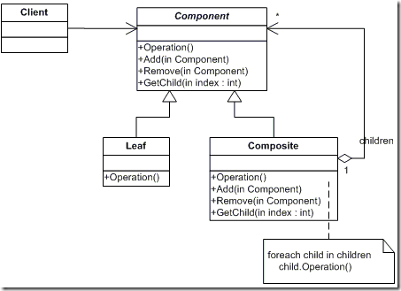
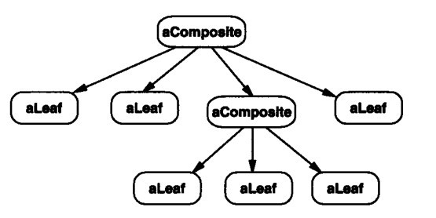
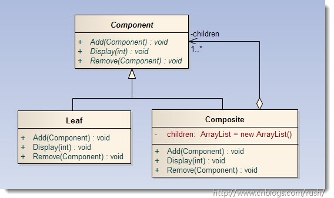
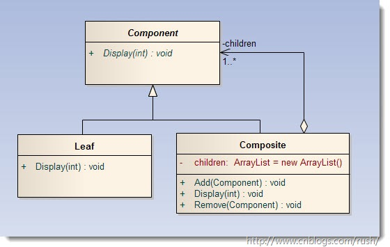
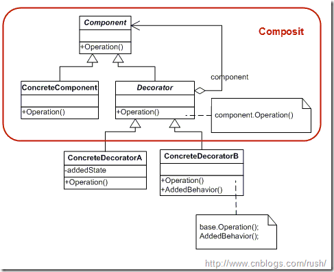

#组合模式Composite（结构型）

将对象组合成树形结构以表示“部分-整体”的层次结构。Composite 使得用户对单个对象和组合对象的使用具有一致性。

关于分级数据结构的一个普遍性的例子是你每次使用电脑时所遇到的: **文件系统**。
文件系统由目录和文件组成。每个目录都可以装内容。目录的内容可以是文件，也可以是目录。
按照这种方式，计算机的文件系统就是以递归结构来组织的。
如果你想要描述这样的数据结构，那么你可以使用组合模式 Composite。

##适用性

- 你想表示对象的部分-整体层次结构
- 你希望用户忽略组合对象与单个对象的不同，用户将统一地使用组合结构中的所有对象。

##结构图

 Component

        它是一个抽象角色，为对象的组合提供统一的接口。

        为其派生类提供默认的行为。

        通过该接口来访问和管理Child Components（节点后继）。

        通过该接口来访问Parent Components（节点前驱）。
 
 Leaf
 
        代表参加组合的叶子对象（叶子没有后继）。
 
        定义组成原始对象的行为。
         
 Composite
  
         定义非叶子对象的行为。
  
         实现Component中的孩子操作行为（如：Add()，Remove() 等）。

##对象结构

##透明方式和安全方式

###透明方式

在Component中声明所有用来管理子对象的方法，如Add()方法，Remove()方法及GetChild()方法，
所有实现Component接口的子类都具备这些方法，这使得Component和子类具备一致的行为接口，
使得对客户端无需区别树叶和树枝对象。

大家可以回忆一下代理模式（Proxy）中，Proxy，RealSubject类和Subject接口具备一致的行为接口，
从而使得被代理者对于客户端是透明的。

正由于我们的Composite和Leaf都具备一致的接口行为，但我们知道Leaf不应该具有Add()，Remove()及GetChild()方法，
因为我们叶子节点不能再添加和移除节点了。

代码见包 `com.ld.pattern.composite.tmcompostie`

###安全方式

在透明模式基础上把Component中声明所有用来管理子对象的方法移到Composite中，
在Composite实现子对象的管理方法，那么Leaf就没有子对象管理方法，
这使得Composite和Leaf的行为接口不一致，所以客户端在调用时要知道树叶和树枝对象存在。

代码见包 `com.ld.pattern.composite.aqcompostie`

##与装饰者模式(Decorator)的关系

装饰者模式（Decorator）是通过组合模式（Composite）来构建起一棵对象树，
然后通过装饰者的子类来扩展装饰者（即Composite）的行为，从而实现对具体组件装饰行为（即Leaf）。

#总结

1.组合模式（Composite）采用树形层次结构来实现对象容器，
如：绘图程序例子我们把各种各样的图形添加的Shape中，从而构造起一条对象链，把“一对多”的关系转化“一对一”的层次关系，
使得客户代码可以一致地处理对象和对象容器，无需关心处理的是单个的对象，还是组合的对象容器。

2．组合模式（Composite）中，透明方式和安全方式的使用抉择，虽然透明方式有可能违背面向对象的SRP原则（单一职责），
而安全方式没有很好的封装变化，但在实际开发时我们要根据具体的情况权衡利弊。

##优点：
1. 组合模式可以很容易的增加新的构件。
2. 使用组合模式可以使客户端变的很容易设计，因为客户端可以对组合和叶节点一视同仁。

##缺点：
1. 使用组合模式后，控制树枝构件的类型不太容易。
2. 用继承的方法来增加新的行为很困难。